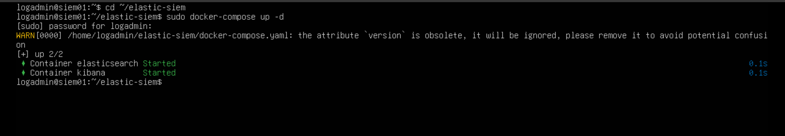
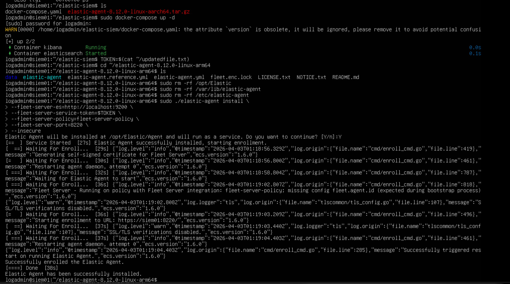
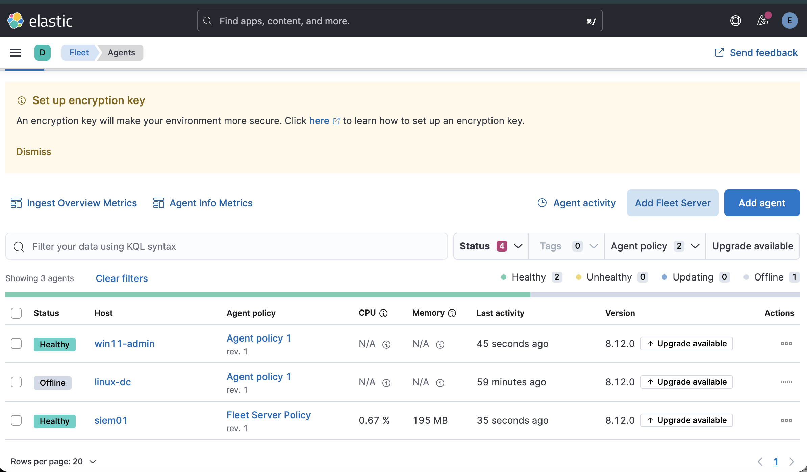

# Elastic Stack Deployment

## 📌 Objective

Deploy and configure a fully functional SIEM using the Elastic Stack to ingest, analyze, and monitor logs from both Linux and Windows systems.

---

## 🧠 Architecture Overview

```
Windows / Linux Endpoints
          ↓
     Elastic Agent
          ↓
     Fleet Server
          ↓
    Elasticsearch
          ↓
        Kibana
```

---

## 🔧 Core Components

- Docker (Infrastructure Layer): Used to deploy Elasticsearch and Kibana
- Elasticsearch (Data Engine): Acts as the SIEM backend
- Kibana (Visualization & Management): Web interface for log analysis
- Fleet (Control Plane): Centralized management of Elastic Agents
- Fleet Server: Acts as communication hub between agents and Elasticsearch
- Elastic Agents: Installed on Linux server (AD lab environment) and Windows endpoint

---

## 🔐 Authentication Model

| Token Type       | Purpose                                     |
| ---------------- | ------------------------------------------- |
| Service Token    | Authenticates Fleet Server to Elasticsearch |
| Enrollment Token | Allows endpoints to join Fleet              |

---

## ⚙️ Deployment Steps

### 1. Deploy Elastic Stack (Docker)

* Start Elasticsearch and Kibana containers
* Verify services are reachable

---

### 2. Enable Security

* Configure built-in users
* Set passwords for:

  * `elastic`
  * `kibana_system`

---

### 3. Initialize Fleet

* Access Kibana → Fleet
* Configure Fleet settings

---

### 4. Deploy Fleet Server



---

### 5. Install Linux Agent

```bash
sudo ./elastic-agent install \
  --url=https://<SIEM-IP>:8220 \
  --enrollment-token=TOKEN \
  --insecure
```

---

### 6. Install Windows Agent

```powershell
.\elastic-agent.exe install `
  --url=https://<SIEM-IP>:8220 `
  --enrollment-token=TOKEN `
  --insecure
```

---

## ✅ Validation

* Fleet Server status: **Healthy**
* Linux Agent: **Healthy**
* Windows Agent: **Healthy**

---

## 🧠 Key Takeaways

* Built a centralized SIEM from scratch
* Implemented secure agent communication (TLS)
* Established log ingestion pipeline for detection
