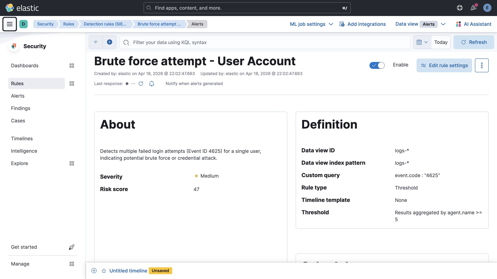
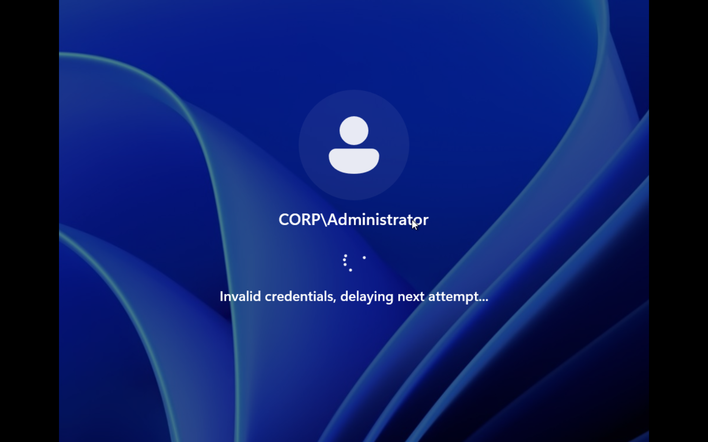
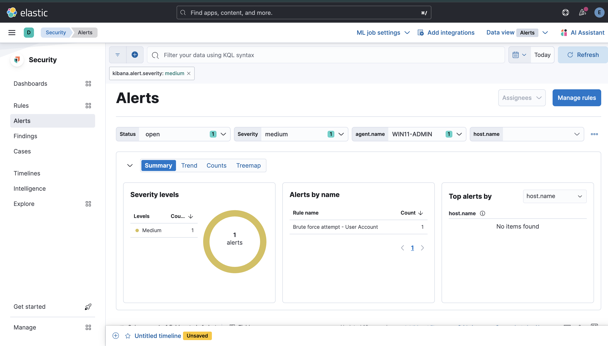

# 🚨 Windows Brute Force Detection – Log Ingestion Validation

## 🧠 Objective

Validate that:
- Windows security logs are successfully ingested into the SIEM
- Failed login attempts (Event ID 4625) are detectable
- Detection rules trigger alerts based on suspicious behavior

---

## 🏗️ Environment

| Component        | Role                         |
|----------------|------------------------------|
| Windows 11 VM   | Target system (log source)   |
| Elastic Agent   | Log collector               |
| Fleet Server    | Agent management            |
| Elasticsearch   | Data storage                |
| Kibana          | Visualization & detection   |

---

## 🔍 Event of Interest

### Event ID: 4625 – Failed Logon

This event is generated when a login attempt fails on a Windows system.

### Key Fields:

- `event.code: 4625`
- `user.name`
- `host.name`

---
## 🔧 Step 1 – Create Detection Rule in Kibana

A threshold-based detection rule was created to identify multiple failed login attempts.

---

## 🧪 Step 2 – Simulate Brute Force Attempt

A brute force attack was simulated by repeatedly entering incorrect passwords on the Windows login screen.

---

## 🚨 Step 3 – Alert Triggered

After generating multiple failed login attempts, the detection rule successfully triggered an alert.

## 🧠 Analysis

The alert indicates:
- A single user account experienced multiple failed login attempts
- Activity occurred on a specific host
- Behavior is consistent with brute force or credential guessing attacks

## 🔐 Security Relevance

This detection is critical for identifying:
- Brute force attacks
- Credential stuffing attempts
- Unauthorized access attempts
  
## 🧠 Key Takeaways
- SIEM ingestion pipeline is working correctly
- Endpoint telemetry is successfully collected
- Detection rules can identify suspicious authentication behavior
